<h1 align="center">
  Hi 👋, I'm Vikash Kumar
</h1>

<p align="center">
  
</p>

<p align="center">
  <a href="YOUR_PORTFOLIO_URL">
    
  </a>
  <a href="YOUR_LINKEDIN_URL">
    
  </a>
  <a href="mailto:YOUR_EMAIL">
    
  </a>
</p>

---

## 👨‍💻 About Me

I'm a **Full Stack Developer** focused on building modern, scalable and user-friendly web applications.

I work across the complete development lifecycle — from designing responsive interfaces and building REST APIs to database integration, authentication, payments, containerization and deployment.

```text
Frontend       → React.js • Next.js • JavaScript • TypeScript • Redux
Backend        → Node.js • Express.js • REST APIs
Databases      → MongoDB • PostgreSQL
DevOps         → Docker • Kubernetes • Jenkins • Linux
Other          → SEO • Web Performance • Authentication • Payments
```

I enjoy solving real-world engineering problems and turning ideas into production-ready applications.

---

## 🚀 Featured Projects

<table>
<tr>

<td width="50%" valign="top">

<h3 align="center">💻 CodeBuddy</h3>

<p align="center">
  Developer networking & collaboration platform
</p>

<p align="center">
  
</p>

* 🔐 Authentication & authorization
* 💬 Real-time communication
* 🤝 Developer connections
* 💳 Premium payments
* 📧 Email notifications
* 🐳 Dockerized architecture

<p align="center">
  <a href="YOUR_CODEBUDDY_DEMO">Live Demo</a> •
  <a href="YOUR_CODEBUDDY_REPO">Source Code</a>
</p>

</td>

<td width="50%" valign="top">

<h3 align="center">🛒 ShopHub</h3>

<p align="center">
  Full-stack e-commerce platform
</p>

<p align="center">
  
</p>

* 🛍️ Product & cart management
* 🔐 Authentication
* 👤 User & order management
* 💳 Payment integration
* ☁️ Cloud image uploads
* ⚡ Next.js App Router

<p align="center">
  <a href="YOUR_SHOPHUB_DEMO">Live Demo</a> •
  <a href="YOUR_SHOPHUB_REPO">Source Code</a>
</p>

</td>

</tr>
</table>

---

## 🛠️ Tech Stack

<div align="center">

### 🎨 Frontend


### ⚙️ Backend & Databases


### 🚀 DevOps & CI/CD


### 🧩 Tools & Development


</div>

---

## 🧠 Currently Exploring

```text
Micro Frontends
      ↓
Containerization with Docker
      ↓
Kubernetes
      ↓
CI/CD with Jenkins
      ↓
System Design & Scalable Architecture
```

I'm continuously improving my understanding of **distributed systems, deployment architecture, performance and scalable application design**.

---

## 🏗️ How I Think About Full-Stack Applications

```text
                    👤 User
                      │
                      ▼
              ┌───────────────┐
              │ React / Next  │
              │   Frontend    │
              └───────┬───────┘
                      │
                      ▼
              ┌───────────────┐
              │ REST API /    │
              │ Server Logic  │
              └───────┬───────┘
                      │
              ┌───────┴───────┐
              ▼               ▼
        ┌──────────┐     ┌───────────┐
        │ MongoDB  │     │ PostgreSQL│
        └──────────┘     └───────────┘
                      │
                      ▼
                ┌───────────┐
                │  Docker   │
                └─────┬─────┘
                      │
                      ▼
              ┌───────────────┐
              │ Kubernetes /  │
              │    Jenkins    │
              └───────────────┘
```

---

## ⚡ What I Like Building

* 🚀 Full-stack web applications
* ⚛️ Modern React & Next.js applications
* 🔌 REST APIs and backend services
* 🔐 Authentication & authorization systems
* 💳 Payment integrations
* 💬 Real-time applications
* 🐳 Containerized applications
* 🔄 CI/CD pipelines
* 🔍 SEO-friendly & performant websites

---

<details>
<summary><strong>📚 More About Me</strong></summary>

<br/>

* 💻 Full Stack Developer
* ⚛️ Strong focus on React.js & Next.js
* 🔧 Hands-on backend development with Node.js & Express
* 🗄️ Experience with MongoDB & PostgreSQL
* 🐳 Working with Docker and containerized applications
* ☸️ Exploring Kubernetes
* 🔄 Learning and implementing CI/CD with Jenkins
* 🧩 Exploring Micro Frontend architecture
* 🧠 Interested in system design and scalable architectures
* 🌱 Always learning and building

</details>

---

## 📊 GitHub Stats

<table>
  <tr>
    <td width="50%" align="center">
      
    </td>
    <td width="50%" align="center">
      
    </td>
  </tr>
</table>


---
## 📈 GitHub Activity

<p align="center">
  
</p>


---

## 🐍 Contribution Graph

<p align="center">
  <picture>
    <source
      media="(prefers-color-scheme: dark)"
      srcset="https://raw.githubusercontent.com/gitsforvikki/gitsforvikki/output/github-contribution-grid-snake-dark.svg"
    />
    <source
      media="(prefers-color-scheme: light)"
      srcset="https://raw.githubusercontent.com/gitsforvikki/gitsforvikki/output/github-contribution-grid-snake.svg"
    />
    
  </picture>
</p>


---

## 🤝 Let's Connect

<p align="center">

<a href="YOUR_PORTFOLIO_URL">
  
</a>

<a href="YOUR_LINKEDIN_URL">
  
</a>

<a href="mailto:YOUR_EMAIL">
  
</a>

</p>

<p align="center">
  <i>Building, learning, and solving problems — one project at a time.</i>
</p>
